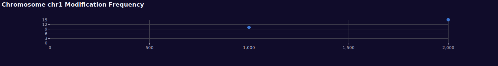

[](https://github.com/bwbioinfo/rs-chromplotter/actions/workflows/rust.yml)

# Simple rust plotting program for plotting modification data along a chromosome

## Example output


## Installation

```bash
cargo install --git https://github.com/bwbioinfo/rs-chromplotter
```

## Usage

```
Simple chromosome scatter plotter

Usage: chromplotter --bedfile <BEDFILE> --chrom <CHROM> --output <OUTPUT>

Options:
  -b, --bedfile <BEDFILE>  The BedMethyl file to read
  -c, --chrom <CHROM>      The chromosome to plot
  -o, --output <OUTPUT>    
  -h, --help               Print help
  -V, --version            Print version
```
